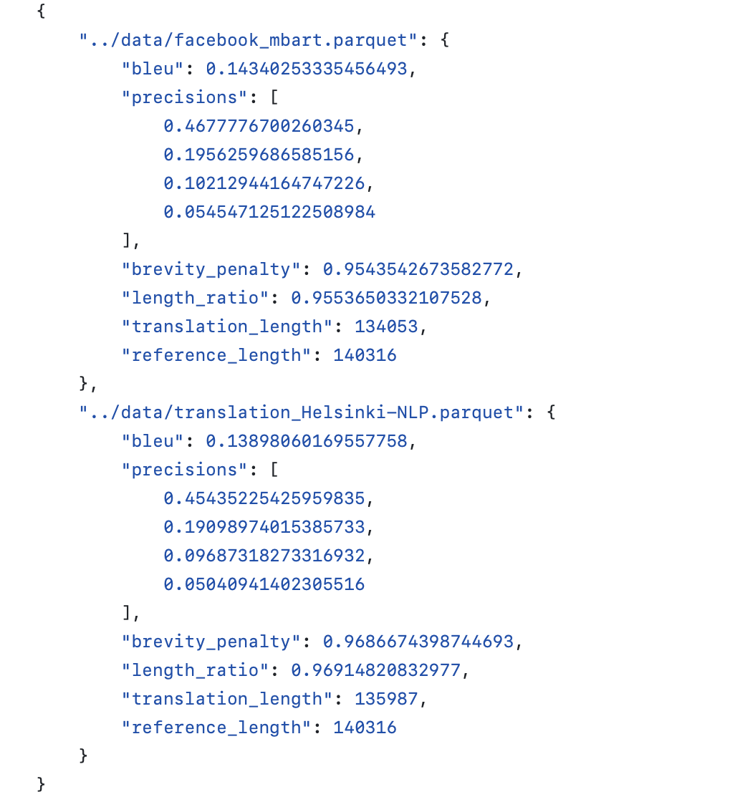
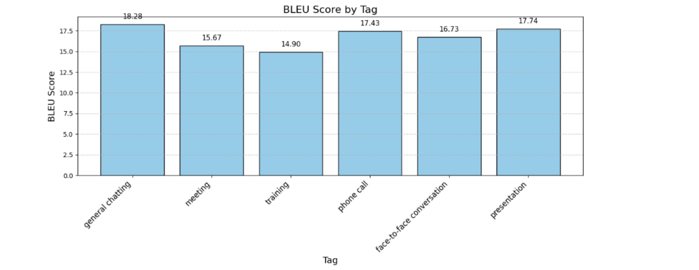

# Exam_Projcet_NLP
Exam project for [TALA540A - Documents structures](https://github.com/RimeAB/TALA540A-24-25/blob/main/Examen_Projet_NLP.md)

We chose a parallel corpus of translation tasks and used it to evaluate the translation model.
## Groupe Member
> [Siman CHEN] (https://github.com/simannnc)
> 
> [Weiqi ZHANG] (https://github.com/CourantEnCourant)
> 
> [Yuntian SHEN] (https://github.com/ShenYT0)
>
## Introduction
We carried out a translation task from Japanese to English by comparing two models: `opus-mt-ja-en` and `mbart-large-50-many-to-many-mmt`, on a benchmark corpus.

## Selected Corpus
**Japanese-English Business Scene Dialogue parallel corpus**

https://paperswithcode.com/dataset/business-scene-dialogue

## Selected Model

The `Helsinki-NLP/opus-mt-ja-en` model is specifically trained to translate from Japanese to English.
https://huggingface.co/Helsinki-NLP/opus-mt-ja-en (For evaluation)

The `mbart-large-50-many-to-many-mmt` model is fine-tuned for multilingual machine translation.
https://huggingface.co/facebook/mbart-large-50-many-to-many-mmt (For comparison)

## Corpus analysis

For more details, please refer to branch [corpus_analysis](https://github.com/ShenYT0/Exam_Projcet_NLP/tree/corpus_analysis)

A detailed account of the description and analysis of various aspects of our chosen corpus is given here.

## Introducing the model

For more details, please refer to branch [model_comparison](https://github.com/ShenYT0/Exam_Projcet_NLP/tree/model_comparison)

The features used in our chosen model are described here, and a comparison of the performance of two different models is presented, with their advantages and disadvantages shown.

## Evaluating the model by corpus

For the script of evalution, please refer to branch [model_evaluation](https://github.com/ShenYT0/Exam_Projcet_NLP/tree/model_evaluation)

We used two models to translate the Japanese portion of the corpus, and compared the machine translation results of the models with the original human translation results of the parallel corpus to calculate the BLEU scores and thus evaluate the models. The results obtained are [here](https://github.com/ShenYT0/Exam_Projcet_NLP/blob/model_evaluation/results/result.json)

As a complement, here [notebook](model_evaluate.ipynb) uses the `Helsinki-NLP/opus-mt-ja-en` model to compute BLEU scores for different sub-corpora.

## Difficulties Encountered
Some parts of the evaluation are conducted with haste. More time will allow us to further improve our scripts for more thorough research (i.e. testing other models, using other metrics.)

## Avenues for Improvement
If other algorithms for evaluating the level of translation can be found, the results can be evaluated more comprehensively.

## Results
The results indicate that  `opus-mt-ja-en` operates faster, and the larger model, `mbart-large-50-many-to-many-mmt`, which is trained on a more extensive dataset, performs slightly better on the specific translation task from Japanese to English.

The difference in BLEU scores between the Facebook MBART and Helsinki-NLP models is relatively small, with Facebook MBART scoring 0.1434 and Helsinki-NLP scoring 0.1389. Although Facebook MBART leads, the margin is not very large. 
Generally speaking, `opus-mt-ja-en` model is smaller and faster, suited for quicker translation tasks with limited resources. `mBART` models, being larger, are generally slower but can achieve a better results with a variety of languages. 
This highlights the balance between speed, accuracy, and computing resources, which is common in machine learning applications.

We further conducted a more detailed analysis on the results based on `opus-mt-ja-en` model.
In the corpus analysis part, we calculated various statistical measures for sentence lengths in both English and Japanese, based on encoded tokens from the sentences in a dataset split. It computes the average (mean) length, the median length, and the third quartile (Q3) length of the sentences.
In [model_evaluate (in main)](model_evaluate.ipynb), we further focus on long sentences using the third quartile we have calculated to identify sentences that are longer than over 20 tokens to create a long sub-corpus for comparison. We found that the Bleu scores have dropped to 14.87, compared to the overall Bleu score, which is 16.85.
Another results we found is that the `opus-mt-ja-en` model is better with spoken text with short sentences, which is evidenced by the fact that the category "general chatting" with shorter sentences have achieved higher bleu scores than other categories.  

In conclusion, the results suggest that while the `opus-mt-ja-en model` is optimized for speed and efficiency, making it ideal for scenarios with resource constraints or the need for quick translations, it performs best with simpler, concise textual inputs. This aligns with common trade-offs observed in machine learning applications, where the balance between speed, accuracy, and computing resources must be carefully managed.
